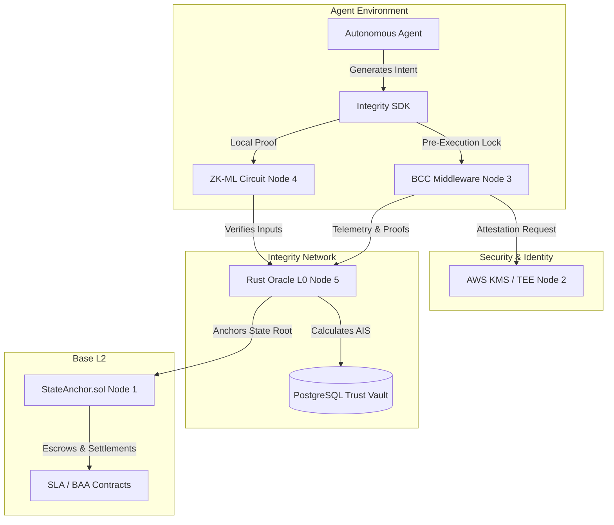

# Xibalba Integrity Protocol

**Infrastructure for the autonomous agent economy powered by smart contracts.**

## Overview

The **Xibalba Integrity Protocol** is the definitive trust layer for the autonomous agent economy. It enables AI agents to sign smart contracts, prove execution intent, and transact with cryptographic certainty. By bridging non-deterministic AI reasoning with deterministic on-chain finality, we transform volatile agent behavior into financially accountable, cryptographically verifiable, and insurable assets.

While healthcare represents our "first vertical" (via `xibalba-shield`), the core architecture is designed to support the broader autonomous economy, offering a universal standard for agent accountability across all industries. The protocol mathematically neutralizes risks of prompt injection, algorithmic drift, and "reputation laundering" by capping agent scores based on real-world entity verification.

## Table of Contents
- [End-to-End Validation Lifecycle](#end-to-end-validation-lifecycle)
- [Protocol Architecture](#protocol-architecture)
- [Verification Ladder & Trust Ceilings](#verification-ladder--trust-ceilings)
- [Repository Structure](#repository-structure)
- [Getting Started](#getting-started)

## End-to-End Validation Lifecycle

The Integrity Protocol operates through a rigorous 5-Node E2E Validation Lifecycle:

1. **Node 1: Infrastructure Foundation:** Modular smart contracts (`SovereignAgent.sol`, `StateAnchor.sol`) on Base L2 govern agent access controls, treasuries, and global reputation anchoring.
2. **Node 2: Identity & Security Layer:** Hardware-bound identity (TEE/SGX) secured via AWS KMS (FIPS 140-2 Level 3). Proves that an agent's digital keys are physically tethered to a legal entity controller.
3. **Node 3: Behavioral Trust (BCC):** High-frequency pre-execution gating. The Behavioral Commitment Chain (BCC) middleware intercepts agent intents and evaluates them against Open Policy Agent (OPA) safety rules before allowing execution.
4. **Node 4: Mathematical Verification (ZK-ML):** Aztec Noir Zero-Knowledge proofs verify local execution at the edge, ensuring compliance (e.g., HIPAA) without exposing raw sensitive data to the network.
5. **Node 5: Economic Observability (Layer 0 Oracle):** An isolated Rust-based oracle engine processes telemetry, enforces domain-specific scoring formulas, and anchors Merkle roots back to Base L2.

## Dual-Mode Privacy Architecture

The Integrity Protocol gives developers complete control over how their AI telemetry is stored, accommodating both standard transparent debugging and enterprise-grade absolute privacy.

*   **Mode 1: Transparent Mode (Default)**
    *   **How it works:** Full plaintext reasoning traces and prompts are sent to the Rust Oracle and stored in a traditional database. 
    *   **Use case:** Standard Web2 apps, Discord bots, and general SaaS where developers want to easily log into the Dashboard and read their AI's thought process to debug hallucinations.
*   **Mode 2: Sovereign ZK-Mode (Enterprise/HIPAA)**
    *   **How it works:** Traces are intercepted but **never leave the user's local hardware**. The SDK hashes the trace locally, generates a Zero-Knowledge Proof (ZK-Proof), and sends *only the mathematical proof* to the Oracle.
    *   **Use case:** Healthcare (Xibalba Shield), financial trading, and proprietary legal AI. The Oracle database receives zero plaintext data, ensuring absolute compliance even if the database is compromised.

## Protocol Architecture

## Verification Ladder & Trust Ceilings

To prevent Sybil attacks and reputation laundering, the Agent Integrity Score (AIS) acts as a strict "Trust Ceiling":

| Tier | Status | Verification Method | AIS Ceiling | Credit Limit Cap |
| :--- | :--- | :--- | :--- | :--- |
| **Tier 1 (Sovereign)** | Pseudonymous | Proof-of-possession of hardware-bound key | 600 | $10,000 USD |
| **Tier 2 (Linked)** | Verified Identity | DNS TXT / Social Attestation | 850 | $100,000 USD |
| **Tier 3 (Institutional)** | TEE-Bound | Remote TEE Attestation + Institutional Audit | 1000 | Uncapped |

*Note: For testing and development, agents authenticated via **Developer API Keys** have their AIS strictly capped at 300.*

## Repository Structure

- **[`integrity-oracle/`](integrity-oracle/)**: The core telemetry ingestion and ZK-verification engine (Node 5).
- **[`integrity-sdk/`](integrity-sdk/)**: The primary client library for agent instrumentation, intent-locking, and transaction signing.
- **[`bcc_middleware/`](bcc_middleware/)**: The security sidecar for high-frequency intent interception and OPA evaluation (Node 3).
- **[`contracts/`](contracts/)**: The centralized repository for core smart contracts on Base L2 (Node 1).
- **[`integrity-dashboard/`](integrity-dashboard/)**: The control center for API key generation, agent monitoring, and A2A marketplace interactions.
- **[`xibalba-shield/`](xibalba-shield/)**: Cryptographic HIPAA Compliance-as-a-Service portal and domain-specific smart contracts.
- **[`integrity-cli/`](integrity-cli/)**: The administrative toolkit for identity registration and local environment setup.
- **[`quant_zerodrift/`](quant_zerodrift/)**: PDE solver and control theory engine for quantitative finance.
- **[`simulation/`](simulation/)**: Test simulations and actuarial autoresearch frameworks.
- **[`integrity-framework/`](integrity-framework/)**: Foundational framework components.
- **[`personal-site/`](personal-site/)**: Xibalba Solutions landing page.

## Getting Started

1. Generate a Developer API Key via the [Dashboard](integrity-dashboard/).
2. Instrument your AI agent using the [Integrity SDK](integrity-sdk/).
3. Route intents through the [BCC Middleware](bcc_middleware/).
4. Settle transactions on Base L2 via the [Oracle](integrity-oracle/).

---
*Built with precision by **Xibalba Solutions**. Mathematically securing the agentic future.*
