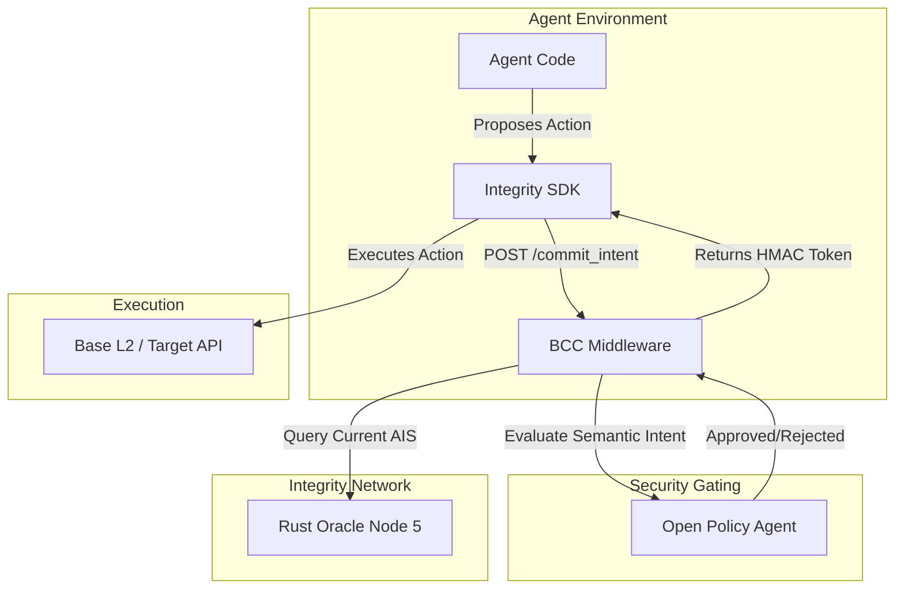

# BCC Middleware (Node 3: Behavioral Trust & Intent Validation)

**High-Frequency Intent Interception and Security Gating for Autonomous Agents.**

## Overview

The `bcc_middleware` is the primary security gatekeeper for the Xibalba Integrity Protocol. It serves as **Node 3** in the End-to-End Validation Lifecycle. Built as a fast Python sidecar, it forces autonomous agents to cryptographically commit their reasoning and intended actions before any smart contract is executed or database is mutated.

This proactive approach prevents prompt injections, unauthorized API calls, and algorithmic hallucinations from manifesting on-chain.

## Table of Contents
- [Architecture & Protocol Role](#architecture--protocol-role)
- [Technical Specifications](#technical-specifications)
- [Installation & Setup](#installation--setup)
- [Configuration](#configuration)
- [Usage & API](#usage--api)
- [Development & Testing](#development--testing)

## Architecture & Protocol Role

The BCC Middleware sits precisely between the Agent (Node 4) and the final Execution Layer (Base L2 / APIs):



### Key Responsibilities
1. **Intent Interception:** Receives raw agent intents via the `/commit_intent` endpoint.
2. **OPA Policy Enforcement:** Evaluates intents against Rego policies running in Open Policy Agent (e.g., preventing unauthorized HIPAA PHI access).
3. **Compute Circuit Breaking:** Throttles agents in real-time if their performance variance (entropy) breaches safety thresholds.
4. **HMAC Approbation:** If approved, issues a cryptographically signed token proving that the intent was vetted by the middleware.

## Technical Specifications
- **Language/Framework:** Python 3.10+ / FastAPI
- **Policy Engine:** Open Policy Agent (OPA) via REST
- **Cryptographic Signatures:** HMAC-SHA256 for approbation tokens.

## Installation & Setup

BCC Shield is typically deployed as a sidecar to your agent or as a dedicated security cluster.

### Prerequisites
- Python 3.10+
- Open Policy Agent (OPA) installed locally

### Setup
```bash
cd bcc_middleware
pip install -e .
```

## Configuration

The middleware expects the following environment variables:

- `INTEGRITY_ORACLE_URL`: URL to the Rust Oracle (Node 5). Default: `http://localhost:3000`
- `OPA_URL`: URL to the OPA server. Default: `http://localhost:8181`
- `BCC_AIS_THRESHOLD`: Minimum Trust Level (AIS) required for the agent to bypass strict restrictions. Default: `600` (Sovereign Level).

## Usage & API

### 1. Run OPA with Guardrails
Before starting the middleware, launch OPA with your specific security policies (e.g., HIPAA guardrails):
```bash
opa run --server ./policies/OPA_HIPAA_Guardrails.rego
```

### 2. Run BCC Middleware
Start the FastAPI server:
```bash
export BCC_AIS_THRESHOLD=600
uvicorn main:app --port 8002
```

### Endpoints
- `POST /v1/commit_intent`: Submit an agent intent for validation.
- `GET /health`: Check middleware and OPA connectivity.

## Development & Testing
Run the test suite using pytest:
```bash
pytest tests/
```
