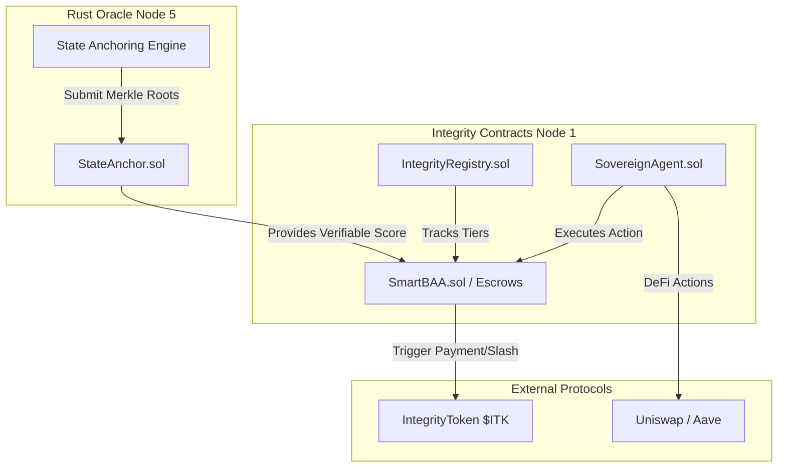

# Integrity Protocol Contracts (Node 1: Infrastructure Foundation)

**The Authoritative Smart Contract Repository for the Xibalba Integrity Protocol.**

## Overview

The `contracts` directory serves as the definitive source of truth for all on-chain logic in the Integrity Protocol ecosystem. As **Node 1** in the End-to-End Validation Lifecycle, these EVM-compatible contracts provide the decentralized infrastructure required to govern agent identities, anchor reputation states, and settle SLA escrows on Base L2.

By bridging unpredictable AI behavior with deterministic on-chain execution, these contracts transform volatile agents into financially accountable and insurable assets.

## Table of Contents
- [Architecture & Protocol Role](#architecture--protocol-role)
- [Technical Specifications](#technical-specifications)
- [Core Primitives](#core-primitives)
- [Installation & Setup](#installation--setup)
- [Configuration](#configuration)
- [Usage & Deployment](#usage--deployment)
- [Development & Testing](#development--testing)

## Architecture & Protocol Role

The contracts sit at the foundation of the protocol, securely interacting with the Rust Oracle (Node 5) and the Agent SDK (Node 4):



### Key Responsibilities
1. **Identity & Access Control:** Manages `SovereignAgent.sol`, which binds an agent's on-chain treasury to its verified identity.
2. **State Anchoring:** `StateAnchor.sol` securely receives and stores batched Merkle roots of the global Agent Integrity Score (AIS) database from the Oracle.
3. **Programmable Escrows:** Contracts like `SmartBAA.sol` and Factory instances programmatically enforce SLA terms based on real-time AIS.

## Technical Specifications
- **Framework:** [Foundry](https://book.getfoundry.sh/)
- **Target Network:** Base L2 (Ethereum Rollup)
- **Compliance:** Built to support cryptographic evidence mapping for HIPAA (45 CFR § 164.312(c)(1) Integrity).

## Core Primitives

- **`SovereignAgent.sol`**: On-chain identity and role-based access control for AI agents.
- **`AgentCreditFacility.sol`**: Undercollateralized ITK lending pools restricted by Agent Trust Levels.
- **`StateAnchor.sol`**: Anchors Merkle roots for the global reputation state.
- **`SmartBAA.sol`**: Executable HIPAA legal agreements and slashable SLAs.
- **`XibalbaNameService.sol`**: On-chain handle registry (`.intg` handles).
- **`IntegrityToken.sol` ($ITK):** Deflationary utility token with programmatic burn/slash mechanics.

## Installation & Setup

### Prerequisites
- [Foundry](https://book.getfoundry.sh/getting-started/installation)

### Build
```bash
cd contracts
forge build
```

## Configuration

Copy `.env.example` to `.env` and fill in the required variables:

| Variable | Description |
| :--- | :--- |
| `BASE_SEPOLIA_RPC_URL` | RPC Endpoint for the target network. |
| `PRIVATE_KEY` | Deployer account private key. |

## Usage & Deployment

Deploy the core registry and anchors to a local anvil node or testnet:
```bash
# Example deployment command (see scripts for full flow)
forge script script/DeployCore.s.sol --rpc-url $BASE_SEPOLIA_RPC_URL --broadcast
```

## Development & Testing

We welcome contributions. Ensure all tests pass before submitting a PR.
```bash
forge test
```
To run tests with gas reports:
```bash
forge test --gas-report
```
