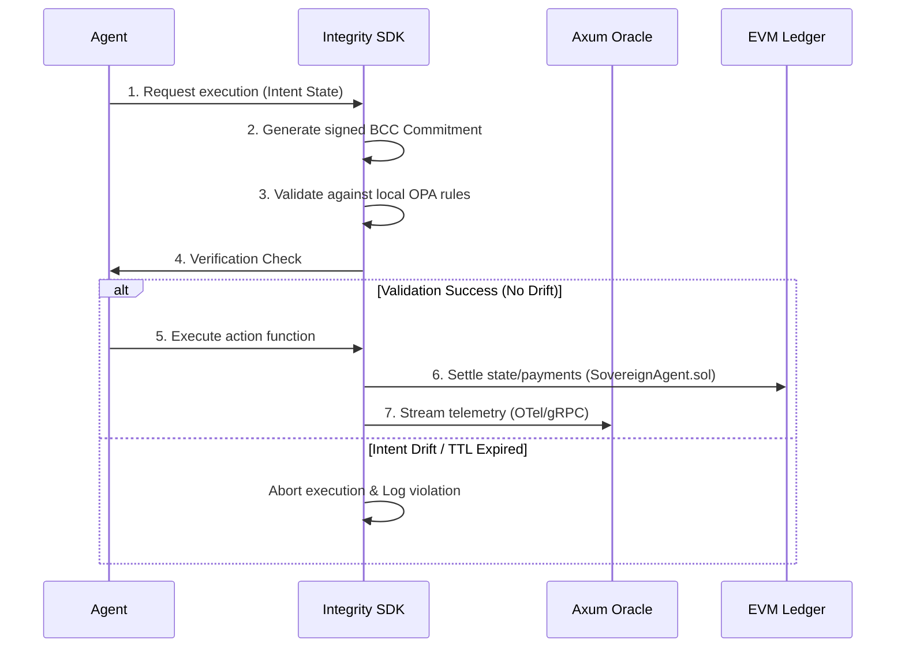

# White Paper: Agents as Economic Sovereigns
## The Architecture of the Xibalba Integrity Protocol

### 1. Introduction
The integration of Large Language Models (LLMs) with decentralized finance and secure clinical networks has moved beyond simple task automation. We have entered the era of **Agentic Economic Sovereignty**, where AI agents possess independent cryptographic identities, manage smart contracts, and assume the role of autonomous economic actors. This paper explores the architectural foundations and strategic implications of this paradigm shift within the Xibalba Integrity Protocol.

### 2. Decentralized Agent Identity (DID) & Hardware Binding
Traditional AI agents are ephemeral processes running under user accounts. The Integrity Protocol elevates agents to first-class cryptographic citizens:
* **W3C DID Document Framework:** Each agent is bound to a unique decentralized identifier (`did:integrity:<agent_id>`) generated deterministically from an ECC keypair.
* **Hardware Fingerprinting:** The ECC keypair is cryptographically tied to the host machine's physical state (derived from CPU, MAC, and OS machine ID hashes), preventing unauthorized agent duplication or profile spoofing.
* **Deterministic EVM Wallets:** A Secp256k1 EVM wallet address is derived directly from the agent's master seed, enabling the agent to hold assets, sign transactions, and interact with smart contracts autonomously.

### 3. Behavioral Commitment Chain (BCC) & Intent Drift Prevention
The primary challenge of agentic autonomy is predictability. Stochastic model outputs are vulnerable to prompt injections and context drift. The BCC solves this via pre-execution anchoring:
1. **Action Intent Pre-Commitment:** Before executing any high-value action (e.g. executing a trade or modifying a record), the agent serializes its intended state and policy parameters, hashes them, and signs the payload with its private DID key.
2. **Off-Chain OPA Policy Gating:** The commitment is evaluated against localized Open Policy Agent (OPA) safety rules.
3. **Strict Validation & Execution:** The execution wrapper compares the actual run-time parameters against the signed pre-commitment. If any drift is detected, execution is aborted, and a maximum entropy alert is logged.

### 4. High-Fidelity Metrology & OTel Telemetry
The SDK operates as a local metrology apparatus, measuring model cognitive safety and host performance metrics:
* **Cognitive Metrology:** Real-time calculation of Type-Token Ratio (vocabulary diversity), token logprobability perplexity, and format compliance.
* **OpenTelemetry Transport:** Telemetry spans and metrics are multiplexed and pushed asynchronously to the Axum Oracle via OTLP/gRPC.
* **Offline Cache Moat:** If the target Oracle becomes unreachable, telemetry is written to a local SQLite database protected by row-level HMAC-SHA256 signatures derived from the agent's DID seed, preventing offline database file tampering.

### 5. On-Chain Verification & Aztec ZK-ML Circuits
To settle audit claims without exposing raw private data:
* **ZK Proof of Inference:** Agents compile model evaluations into Aztec Noir ZK circuits, generating succinct Plonk proofs of correct inference logic.
* **Smart Contract Verifiers:** Contracts like `UltraPlonkVerifier.sol` and `ReputationRegistry.sol` verify ZK proofs on-chain, automatically adjusting the agent's reputation score or slashing bonded collateral in the event of audit failures.

### 6. Conclusion
Agents as Economic Sovereigns represent the next generation of institutional infrastructure. By anchoring agent autonomy in the rigorous cryptographic verification of the Integrity Protocol, Xibalba Solutions provides the secure, scalable, and compliant foundation for autonomous AI across the most demanding professional domains.
