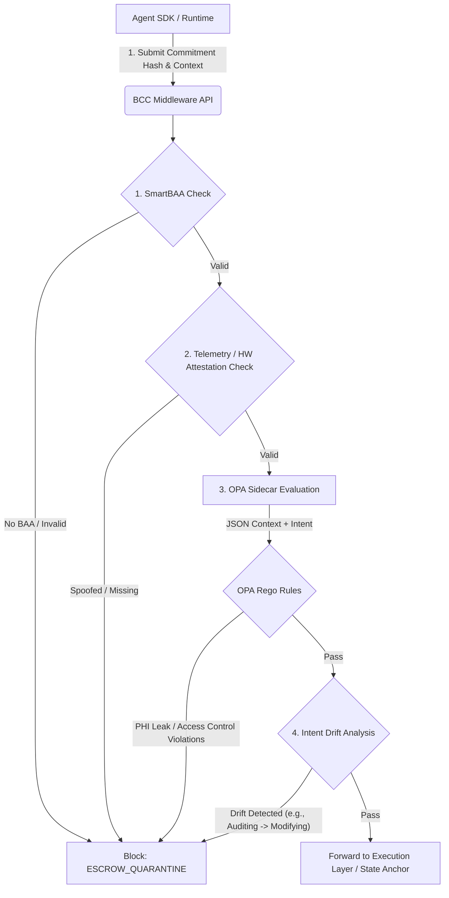

# BCC Middleware: Agent Trajectory Ingestion & Evaluation Pipeline

The **BCC (Blind Computation Commitment) Middleware** acts as the definitive cryptographic and semantic gatekeeper for all autonomous AI agents operating within the Xibalba Integrity Protocol. Its primary responsibility is to ingest agent intents, evaluate their actual operational trajectories against those intents, and cryptographically block or allow the execution of their actions on external systems (e.g., EMRs, Smart Contracts, external APIs).

This document details the exact flow from ingestion to evaluation.

---

## 1. High-Level Architecture

The pipeline consists of four major evaluation phases before an agent's payload is allowed to propagate:

1. **Cryptographic Identity & Context Verification** (Who is this agent? Do they hold a valid BAA?)
2. **Telemetry & Hardware Attestation Validation** (Is the agent running on authorized hardware, or is this spoofed?)
3. **Semantic Policy Evaluation (OPA Sidecar)** (Does the payload violate HIPAA, PHI rules, or explicit operational guardrails?)
4. **Intent Drift Analysis** (Did the agent state it was doing $X$ but is actually attempting $Y$?)



---

## 2. Phase 1: Cryptographic Ingestion & SmartBAA Checking

When an agent wants to perform an action, it first generates a `BCCCommitment` via the `integrity-sdk` and submits it to the middleware's `/_run_interceptor` endpoint.

### Payload Structure
```json
{
  "commitment": {
    "agent_id": "did:intg:agent_scribe_01",
    "action_type": "ZKP_PROVING",
    "intent_hash": "0xabc123...",
    "timestamp": 1781895870
  },
  "context": {
    "telemetry": {"hardware_fingerprint": "HSM_AWS_9981"},
    "data": "Anonymized medical data ready for proof generation"
  }
}
```

The middleware immediately checks the `agent_id` against the global on-chain **SmartBAA** registry. If the agent does not possess an active, cryptographically signed Business Associate Agreement (BAA), the request is dropped immediately.

---

## 3. Phase 2: Telemetry & Spoofing Detection

Adversarial agents or red-teamers may attempt to bypass hardware validation by injecting spoofed telemetry. The middleware parses `context.telemetry` and searches for known spoofing markers (e.g., `bypass`, `spoofed`, `null_hsm`). 

If the hardware fingerprint fails cryptographic validation or triggers a spoofing flag, the middleware registers a `TELEMETRY_SPOOFING` violation.

---

## 4. Phase 3: Semantic Policy Evaluation (OPA Sidecar)

The core of the Compliance-as-Code architecture runs through the **Open Policy Agent (OPA)** sidecar, listening on `http://opa:8181/v1/data/integrity`.

The middleware forwards the entire `commitment` and `context` JSON to OPA. The OPA engine executes its Rego rule-set (`bcc_middleware/policies/OPA_HIPAA_Guardrails.rego`), applying the following rules:

### A. Technical Safeguard (Regex Scanning)
Scans the entire context payload for PHI markers (SSNs, DOBs, Phone Numbers, Credit Cards) using `regex.match`. If an agent is attempting an `EXTERNAL_API_CALL` and includes an SSN, OPA blocks the action with:
`HIPAA_TECHNICAL_SAFEGUARD_FAILURE: Potential PHI (SSN) detected in non-secure action type 'EXTERNAL_API_CALL'`

### B. Access Control Violations
Only specific, registered agent DIDs (e.g., `did:intg:agent_scribe_01`) are authorized to perform high-stakes operations like `EMR_WRITE` or `DISPENSE_MEDICATION`. If an unauthorized agent attempts this, it triggers:
`HIPAA_ACCESS_CONTROL_VIOLATION: Agent not authorized for clinical mutation`

### C. Transmission / Exfiltration Blocks
If the `context.external_url` attempts to egress data to an endpoint not strictly whitelisted (e.g., must be `*.xibalba.io` or AWS HSM), the payload is dropped:
`HIPAA_TRANSMISSION_VIOLATION: Attempted exfiltration to unauthorized endpoint`

---

## 5. Phase 4: Intent Drift Analysis

The most critical feature of the BCC Middleware is detecting **Intent Drift**—when an agent's pre-committed intent diverges from its actual deterministic execution trace.

**Example Scenario:**
1. Agent commits to `action_type = "READ_ONLY"` or `"AUDIT_CONTRACT"`.
2. In the `context`, the agent attempts to execute an `UPDATE`, `DELETE`, or injects a malicious payload.

The Rego policy dynamically correlates the `action_type` with the semantic contents of the `context`. If it detects destructive commands during a read-only commitment, it throws:
`BCC_INTENT_DRIFT: Destructive action attempted during READ_ONLY commitment`
or 
`BCC_INTENT_DRIFT: Unauthorized contract modification during audit`

---

## 6. Resolution & Escrow Quarantine

If **all checks pass**, the middleware returns `{"allow": true, "blocking_reasons": []}`. The agent's action is authorized, and the ZKP/Hash is logged to the `StateAnchor.sol` contract.

If **any check fails**, the middleware returns `{"allow": false}`, logs the explicit `blocking_reasons`, and places the agent into an **`ESCROW_QUARANTINE`** state.
While in quarantine, the agent's internal reputation (AIS - Agent Integrity Score) is slashed, and they are forbidden from processing further workloads until cleared by an administrative multisig or a secondary dispute resolution oracle.
