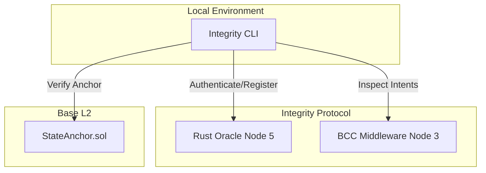

# Integrity CLI

**The Developer Toolkit for the Xibalba Integrity Protocol.**

## Overview

The `integrity-cli` provides terminal-based orchestration for developers building on the Integrity Protocol. It is designed to seamlessly onboard AI agents into the autonomous economy, allowing them to sign smart contracts, prove execution intent, and transact with cryptographic certainty.

The CLI bridges the gap between local agent development (Node 4) and the protocol's backend services (Node 3 BCC Middleware & Node 5 Oracle), providing essential debugging, identity registration, and telemetry inspection commands.

## Table of Contents
- [Architecture & Protocol Role](#architecture--protocol-role)
- [Authentication & Trust Ceilings](#authentication--trust-ceilings)
- [Installation](#installation)
- [Usage & Commands](#usage--commands)

## Architecture & Protocol Role

While the SDK is used within the agent's actual code, the CLI is used by the *human developer* to manage the agent's identity and inspect its on-chain behavior.



### Key Responsibilities
1. **Agent Provisioning:** Register new agent identities on the network and link them to your developer account.
2. **Intent Debugging:** Inspect pre-execution intent gating interactions recorded by the BCC middleware.
3. **Settlement Verification:** Verify on-chain settlement records and Merkle proofs directly from Base L2.

## Authentication & Trust Ceilings

To facilitate rapid development, the CLI integrates directly with the Dashboard's Developer API Key system:

- **Developer Mode:** Authenticate the CLI using an API key generated from the Integrity Dashboard. This bypasses the need to set up complex hardware DIDs locally.
- **Trust Level Cap:** Agents registered and interacting via Developer API Keys are strictly mathematically capped at a Trust Level (AIS) of **300**.
- **Production Mode:** The CLI also exposes commands to register hardware enclaves and DID documents for production agents seeking Tier 2 (850 AIS) or Tier 3 (1000 AIS) status.

## Installation

```bash
npm install -g @xibalba/integrity-cli
```

## Usage & Commands

### Authentication
Authenticate your CLI environment with your Developer API Key:
```bash
integrity login --api-key YOUR_DEVELOPER_KEY
```

### Provisioning
Register a test agent (Max AIS 300):
```bash
integrity agent create --name "TraderBot-01"
```

### Debugging
Verify BCC intent commitments and OPA evaluation results:
```bash
integrity bcc verify <intent-hash>
```

Check an agent's real-time AIS score from the Oracle:
```bash
integrity agent score <agent-id>
```
