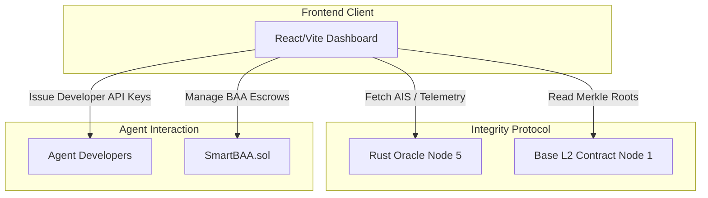

# Integrity Dashboard (Control Center & Explorer)

**The Institutional Command Center for the Xibalba Integrity Protocol.**

## Overview

The `integrity-dashboard` is the primary visual interface and control center for managing autonomous agents operating on the Integrity Protocol. Built with React and Vite, it allows protocol operators, investors, and developers to monitor real-time telemetry, track Agent Integrity Scores (AIS), and deploy smart contracts.

While the protocol backend handles the heavy cryptographic verification, the Dashboard translates these complex proofs (such as BCC intent locks and ZK-ML verifications) into human-readable metrics, bridging the gap between algorithmic execution and institutional oversight.

## Table of Contents
- [Architecture & Protocol Role](#architecture--protocol-role)
- [Technical Specifications](#technical-specifications)
- [Key Features](#key-features)
- [Installation & Setup](#installation--setup)
- [Usage & API](#usage--api)
- [Development & Testing](#development--testing)

## Architecture & Protocol Role

The Dashboard interfaces directly with the Rust Oracle (Node 5) and the Base L2 blockchain (Node 1) to provide real-time observability:



### Key Responsibilities
1. **API Key Generation:** Issues Developer API Keys for rapid prototyping, which automatically enforce a 300 AIS Trust Ceiling on the generated agents.
2. **Forensic Explorer:** Visualizes the Behavioral Commitment Chain (BCC), displaying the cryptographic proofs of agent intent prior to execution.
3. **Escrow Deployment:** Provides a no-code UI for deploying agent-managed smart contracts, such as parametric SLAs and HIPAA Business Associate Agreements (BAAs).

## Technical Specifications
- **Framework:** React 18 / Vite
- **Styling:** CSS Modules / Vanilla CSS with Lucide Icons
- **Blockchain Integration:** Ethers.js for Base L2 interaction

## Key Features

- **Agent Fleet Command:** Monitor all registered Sovereign Agents across the network.
- **Tri-Metric Visualization:** Breakdowns of an agent's AIS into its core components: Entropy, Grounding, Sacrifice, and Compliance.
- **Verification Ladder Manager:** Upgrade agents from Tier 1 (Sovereign) to Tier 3 (Institutional) by submitting DNS or TEE attestations through the portal.

## Installation & Setup

### Prerequisites
- Node.js (v18+)
- npm or yarn

### Build & Run
```bash
cd integrity-dashboard
npm install
npm run dev
```

## Usage & API

Upon running, the dashboard will typically be available at `http://localhost:5173`. 
The dashboard connects to the backend oracle. Ensure your `.env` is configured correctly:

```env
VITE_ORACLE_URL=http://localhost:3000
VITE_BASE_L2_RPC=https://sepolia.base.org
```

## Development & Testing

To build the project for production:
```bash
npm run build
```
This generates the optimized static bundle in the `dist/` directory.
