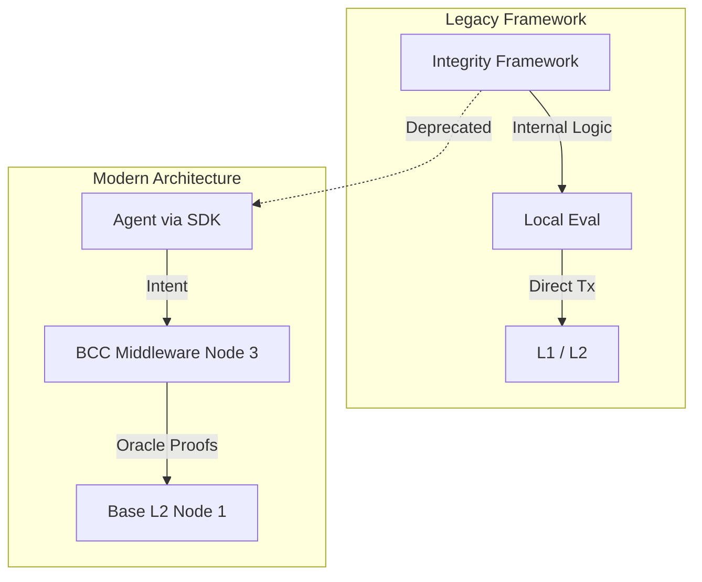

# Integrity Framework (Deprecated / Archived)

**Foundational Components of the Xibalba Integrity Protocol.**

> **⚠️ DEPRECATION NOTICE:** This package contains early iterations of the Integrity Protocol's Python agent framework and supporting services. Active development for agent integration has migrated to the `@xibalba/integrity-sdk` package. 

## Overview

The `integrity-framework` directory was the original testbed for agent orchestration and intent routing before the protocol's architecture was decomposed into discrete microservices (the 5-Node Lifecycle). 

While it is no longer the primary active repository for core protocol features, it remains a valuable historical artifact demonstrating the evolution from monolithic Python agent loops to the decentralized, ZK-backed, Base L2 architecture we use today.

## Table of Contents
- [Architecture Evolution](#architecture-evolution)
- [Legacy Components](#legacy-components)
- [Migration Guide](#migration-guide)

## Architecture Evolution

Originally, this framework housed both the agent logic and the intent gating mechanisms. In the current mainnet-ready architecture, these responsibilities are strictly separated:

## Legacy Components

- **Agent Core:** Early implementations of deterministic action routing.
- **Local Scoring:** Prototype logic for what eventually became the Rust-based Tri-Metric Scoring Engine in the `integrity-oracle`.
- **EVM Bindings:** Outdated Web3.py wrappers used before the transition to Alloy 2.0.

## Migration Guide

If you are maintaining a project that previously imported from `integrity-framework`:

1. **Agent Integration:** Migrate your agent code to use the new Node.js/Python `integrity-sdk`.
2. **Security Gating:** Ensure your deployment now routes through the standalone `bcc_middleware` sidecar rather than relying on local framework evaluations.
3. **Smart Contracts:** Reference the `contracts/` directory for the latest Foundry-based Base L2 primitives.

---
*Maintained as a reference by Xibalba Solutions.*
