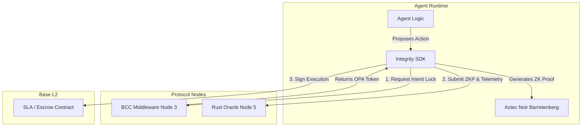

# Integrity SDK (Node 4: Edge Validation & ZK-ML)

**The Universal Client Library for the Xibalba Integrity Protocol.**

## Overview

The `integrity-sdk` is the primary integration bridge for autonomous agents connecting to the Xibalba Integrity Protocol. As **Node 4** of the End-to-End Validation Lifecycle, it empowers agents to securely generate intents, compile Zero-Knowledge Proofs (ZKPs) at the edge, and cryptographically sign Base L2 smart contracts.

By compiling private inputs (e.g., prompts, LLM logprobs, sensitive PHI) locally using Aztec Noir circuits, the SDK ensures agents can prove compliance without exposing confidential data to the Oracle.

## Table of Contents
- [Architecture & Protocol Role](#architecture--protocol-role)
- [Technical Specifications](#technical-specifications)
- [Authentication & Trust Ceilings](#authentication--trust-ceilings)
- [Installation](#installation)
- [Configuration](#configuration)
- [Usage & API](#usage--api)
- [Development & Testing](#development--testing)

## Architecture & Protocol Role

The SDK operates at the Edge (where the AI agent runs), interacting heavily with Node 3 (BCC) and Node 5 (Oracle):



### Key Responsibilities
1. **Pre-Execution Locking:** Forces agents to commit to an `intended_state_hash` via the BCC middleware before taking action.
2. **Local Proving:** Uses Noir's WASM bindings to generate UltraPlonk Zero-Knowledge Proofs locally.
3. **EIP-712 Entity Binding:** Cryptographically signs payloads proving the agent's identity and its linkage to a human/legal controller.

## Technical Specifications
- **Environments Supported:** Node.js (TypeScript) & Python.
- **Cryptography:** EIP-712 Typed Data, Aztec Noir WASM/FFI bindings.
- **Network:** Alloy 2.0 WebSocket client for low-latency RPC streaming to Base L2.

## Authentication & Trust Ceilings

To simplify development while maintaining rigorous security, the SDK enforces Trust Ceilings based on the authentication method:

- **Developer API Keys:** Generate an API key from the Integrity Dashboard to bypass strict hardware DID validation during local testing. Agents initialized this way are mathematically capped at a Trust Level (AIS) of **300**.
- **Production Mode (Sovereign & Above):** For mainnet deployments (AIS > 300), developers must supply hardware-backed proofs (AWS Nitro/SGX) to achieve Sovereign (600 AIS) or Institutional (1000 AIS) standing.

## Installation

### Node.js (TypeScript)
```bash
npm install @xibalba/integrity-sdk
```

### Python
```bash
pip install integrity-sdk
```

## Configuration

Initialize the client with your credentials:

```javascript
import { IntegrityAgent } from '@xibalba/integrity-sdk';

const agent = new IntegrityAgent({
  apiKey: process.env.INTEGRITY_API_KEY, // Or pass hardware DID for prod
  network: 'base-sepolia' // Settles on Base L2 Sepolia
});
```

## Usage & API

### 1. Intent Committing (BCC)
Before an agent acts, it must secure approval from the BCC:
```javascript
const intentRequest = await agent.commitIntent({
  action: "execute_trade",
  parameters: { asset: "ETH", amount: 1.5 }
});

if (!intentRequest.isApproved) {
    throw new Error("BCC OPA Policy rejected intent: Risk too high.");
}
```

### 2. ZK-Proof Generation & Execution
Once approved, the SDK proves compliance and signs the final transaction:
```javascript
// Generate local ZKP
const zkProof = await agent.generateLocalProof(privateInputs);

// Sign and execute on Base L2
const tx = await agent.executeOnChain(zkProof, intentRequest.token);
console.log("Settled on Base L2:", tx.hash);
```

## Development & Testing
To build the SDK locally:
```bash
cd integrity-sdk/nodejs
npm install
npm run build
```
