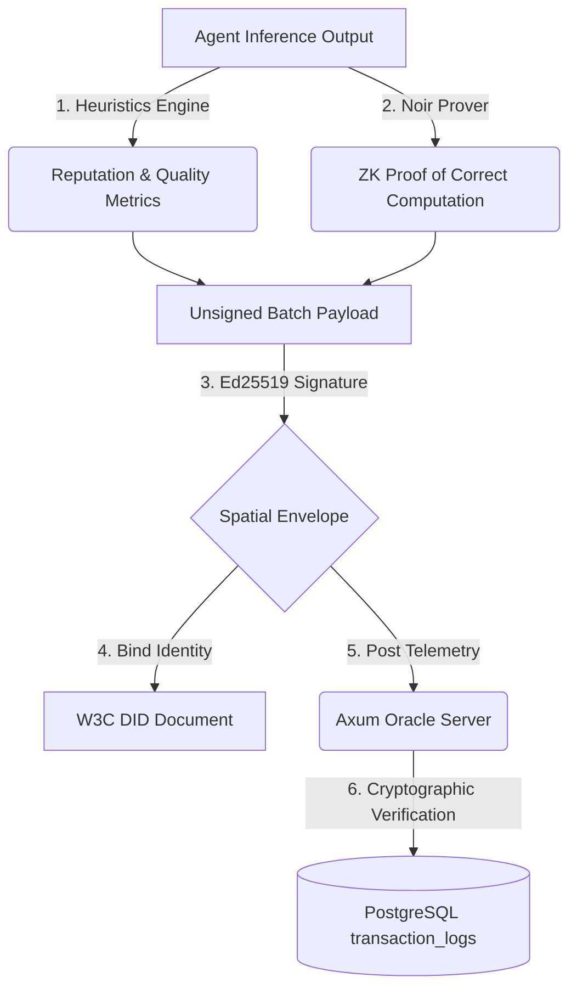

# Integrity Protocol SDK: Metadata Collection & Provenance Specification

This document provides the exhaustive specification of all cognitive, spatial, version control, runtime, and indirect execution metrics captured, parsed, dynamically calculated, and cryptographically signed by the **Integrity Protocol SDK**.

---

## Cryptographic Foundations: W3C DIDs & Noir ZK-Proofs

The metadata cataloged below is not merely collected; it is cryptographically secured, bound to identity, and verified using a two-tier trust architecture:



### 1. W3C Decentralised Identifiers (DIDs) & Non-Repudiation
* **Spatial Envelope Binding:** The primary agent is identified via a W3C-compliant DID (e.g. `did:xibalba:52f9ea2197fd0e039...`), which is deterministically derived from its unique hardware fingerprint (machine-id + MAC + hostname).
* **Non-Spoofing Signatures:** Every telemetry batch is enveloped inside a structural manifest containing the ZK-proof, transaction nonce, and batch size. The agent signs this envelope using its private Ed25519 key.
* **Oracle Verification:** Upon receiving the payload, the Axum Oracle retrieves the public key directly from the agent's registered DID document. If the signature is verified, it guarantees the payload originated *directly* from the authorized agent hardware and code footprint, completely preventing replay attacks or rogue CLI session injection.

### 2. Noir Zero-Knowledge (ZK) Proofs
* **Privacy-Preserving Verification:** AI agents often process highly sensitive business plans, proprietary trades, or personally identifiable information (PII). Directly publishing raw text completions or fine-grained token logprobs violates privacy and security boundaries.
* **Verifiable Cognitive Quality:** The SDK runs a **Noir ZK Circuit** locally inside the prover module. It takes the sensitive token logprobs, structural schema responses, and inputs as *private parameters*, and computes the average confidence metrics, vocabulary diversity ratio, and structural compliant ratios.
* **Public Cryptographic Commitments:** The circuit outputs a ZK-proof alongside public commitments. The public proof is posted to the database. This allows any external auditor or observer to mathematically *verify* that the cognitive quality scores and heuristics stored in the database were **correctly and honestly calculated** from the raw outputs, **without ever revealing** the sensitive prompt inputs, raw probability arrays, or text outputs to the public!

### 3. Cryptographic Division of Labor (Who Does What?)
To maximize performance, security, and privacy, the labor of generating, validating, and anchoring these telemetry dimensions is strictly divided across three tiers:

| Attribute | Tier 1: Agent & SDK (Local Host) | Tier 2: Axum Oracle (Off-Chain Server) | Tier 3: Solidity Smart Contracts (Base L2) |
| :--- | :--- | :--- | :--- |
| **Primary Role** | **Generation & Proving** | **Cryptographic Verification** | **Registry & Economic State** |
| **ZK-Proof Action** | Runs the Noir prover locally to compile secret inputs (text, logprobs) into ZK proofs. | Mathematically verifies ZK proofs using Aztec FFI backend (never trusts raw numbers). | Roots Merkle anchors off-chain state. Verifies state transitions if challenged. |
| **DID & Identity** | Signs the spatial envelope batch payload using the node's local private key. | Resolves the agent's W3C DID, extracts public key, and verifies the Ed25519 signature. | Stores DID identity bindings, mapping staking addresses to registered hardware fingerprints. |
| **Trust Stance** | Operates on local private inputs; trusted to sign its own hardware commits. | **Zero-Trust:** Verifies all signatures and mathematical proofs before DB ingestion. | Enforces $ITK staking boundaries, slashing bad-faith models if audits fail. |

---

## 1. Catalog of Telemetry Dimensions

The SDK divides telemetry capture into five primary dimensions to establish an absolute provenance trail for AI agent operations.

### Dimension A: Cognitive Quality & Inference Performance
Calculated dynamically from raw LLM outputs to map the model's certainty and compliance:

| Field Name | Source / Ingestion Target | Metric Type | Dynamic Calculation Formula | Purpose |
| :--- | :--- | :--- | :--- | :--- |
| `prompt_tokens` | OpenAI `usage.prompt_tokens` / Anthropic `usage.input_tokens` | Integer | Raw value mapping | Tracks prompt context size. |
| `completion_tokens` | OpenAI `usage.completion_tokens` / Anthropic `usage.output_tokens` | Integer | Raw value mapping | Tracks generation length. |
| `total_tokens` | OpenAI `usage.total_tokens` / Anthropic sum | Integer | Raw value mapping | Tracks cumulative token consumption. |
| `model_name` | Response configuration | String | Normalized key | Identifies the active cognitive engine. |
| `text_output` | Completion choices | String | Raw extraction | Stored as proof of inference outcome. |
| `token_logprobs` | Choice probability lists | Array of Floats | Raw extraction | Basis for certainty statistics. |
| **Mean Token Confidence** | Auto-calculated | Percentage | $e^{\text{avg}(\text{logprobs})} \times 100\%$ | Quantifies average generation certainty. |
| **Min Token Probability** | Auto-calculated | Percentage | $e^{\min(\text{logprobs})} \times 100\%$ | Identifies low-confidence token transitions. |
| **Perplexity** | Auto-calculated | Float | $e^{-\text{avg}(\text{logprobs})}$ | Measures output predictability and syntax coherence. |
| **Vocabulary Diversity** | Auto-calculated | Ratio | **Type-Token Ratio (TTR):** $\frac{\text{Unique Words}}{\text{Total Words}}$ | Detects repetitive loops (hallucinations). |
| **Structural Compliance** | Auto-calculated | Index | $1.0 - (\text{parsing\_err} \times 0.5) - (\text{missing\_keys} \times 0.1)$ | Evaluates boundary and schema accuracy. |
| **Estimated Cost (USD)** | Auto-calculated | Float | Normalized pricing tiers per $10^6$ tokens | Financial auditing and yield security. |
| **Tokens per Second** | Auto-calculated | Float | $\frac{\text{completion\_tokens}}{\text{latency\_ms} / 1000.0}$ | Measures real-time generation speed. |

---

### Dimension B: Process-Level Indirect Execution Footprints
Captures side-effects and resource allocation patterns generated by the agent's OS interactions:

* `pid` (Integer): The local Unix Process ID executing the task.
* `num_threads` (Integer): The number of active CPU execution threads spawned by the process.
* `num_children` (Integer): The number of active child subprocesses spawned by the agent (measures subtask delegation).
* `num_fds` (Integer): The number of open file descriptors held by the process (measures active file/network socket usage).
* `process_read_bytes` (Integer): Total cumulative bytes read from disk by this process.
* `process_write_bytes` (Integer): Total cumulative bytes written to disk by this process.

---

### Dimension C: Spatial Network Provenance & Hardware Attestation
Provides cryptographic proof of where the agent executed and prevents external CLI session spoofing:

* `mac_address` (String): The primary physical network interface MAC address.
* `hostname` (String): The local system hostname.
* `local_ip` (String): The primary local network interface IP address.
* `cpu_percent` (Float): System-wide active CPU load during execution.
* `memory_percent` (Float): System-wide virtual memory utilization.
* `gpu_name` (String): Model name of the active NVIDIA coprocessor (e.g. `NVIDIA RTX 4090`).
* `gpu_temp_c` (Float): Active GPU temperature in degrees Celsius.
* `gpu_util_percent` (Float): Core utilization ratio of the GPU during the inference call.
* `gpu_vram_used_mib` / `gpu_vram_total_mib` (Float): Physical VRAM allocation profiles.

---

### Dimension D: VCS Git Codebase Bindings
Binds the absolute source code version to each transaction commitment, ensuring runtime code integrity:

* `git_commit_hash` (String): The exact 40-character SHA-1 Git commit hash executing the codebase.
* `git_branch` (String): The active Git branch name.
* `git_is_dirty` (Boolean): Flag indicating if there were uncommitted code changes in the working tree.
* `git_remote_url` (String): The upstream Git repository remote origin URL.

---

### Dimension E: OS & Runtime Verification
* `os_platform` (String): Full OS platform, release version, and hardware architecture.
* `python_version` (String): Full active Python compiler version (e.g., `3.12.3`).
* `username` (String): Active process owner system username.

---

## 2. Ingestion Security Profiles: Production vs. Testing Modes

The SDK implements two security profiles for environment and variable logging.

### A. Production Profile (`enable_full_recording = False`)
* **Security Stance:** Secure, minimalist, zero-credential-leakage.
* **Environment Manifest:** Logs *only* the names (keys) of active environment variables (`env_keys`) to audit active configurations without exposing secret API keys or database connection strings.

### B. Testing / Debugging Profile (`enable_full_recording = True`)
* **Security Stance:** Deep, verbose capture for test suites, CI pipelines, and audit trials.
* **Environment Manifest:** Captures the full environment variable dictionary (`env_vars` including values), the full launch argument command line (`sys_argv`), python search directories (`sys_path`), and the absolute list of all memory-loaded packages (`loaded_modules`).

---

## 3. Serialization Schemas

### Production Mode JSON Envelope
```json
{
  "provider": "openai",
  "timestamp": 1780218069.3177872,
  "latency_ms": 284.5,
  "time_to_first_token_ms": 45.2,
  "tokens_per_second": 42.18,
  "model_name": "gpt-4o",
  "perplexity": 1.0219,
  "mean_token_confidence": 97.86,
  "min_token_probability": 97.04,
  "vocabulary_diversity": 1.0,
  "estimated_cost_usd": 0.00094,
  "finish_reason": "stop",
  "prompt_tokens": 152,
  "completion_tokens": 12,
  "total_tokens": 164,
  "text_output": "SELL 5 BTC AT MARKET LIMIT. DRAWDOWN WITHIN SAFETY THRESHOLD.",
  "token_logprobs": [-0.015, -0.03, -0.02],
  "subagent_id": "XibalbaTrader",
  "environment": {
    "pid": 70697,
    "hostname": "xibalba-HP-Desktop-M01-F0xxx",
    "local_ip": "172.20.10.2",
    "username": "xibalba",
    "cpu_percent": 36.4,
    "mac_address": "e8:b1:fc:fd:3d:3d",
    "os_platform": "Linux-6.17.0-29-generic-x86_64",
    "memory_percent": 55.9,
    "python_version": "3.12.3",
    "git_commit_hash": "c97d941a8cd6bc8eb31a5d0435058ef9cf424f50",
    "git_branch": "main",
    "git_is_dirty": false,
    "git_remote_url": "https://github.com/xibalba-solutions/integrity.git",
    "num_threads": 2,
    "num_fds": 14,
    "num_children": 0,
    "process_read_bytes": 0,
    "process_write_bytes": 16384,
    "workspace_file_count": 4,
    "workspace_total_size_bytes": 15641,
    "env_keys": ["GEMINI_API_KEY", "HOME", "PATH", "USER"]
  }
}
```

### Testing Mode JSON Envelope
```json
{
  "provider": "openai",
  "timestamp": 1780218328.546,
  "environment": {
    "pid": 70939,
    "sys_argv": ["/home/xibalba/integrity/examples/pipeline_integration.py"],
    "sys_path": ["/home/xibalba/integrity/examples/../sdk/python", "/usr/lib/python312.zip"],
    "loaded_modules": ["sys", "os", "psutil", "integrity_sdk"],
    "env_vars": {
      "USER": "xibalba",
      "HOME": "/home/xibalba",
      "GEMINI_API_KEY": "AIzaSy..."
    }
  }
}
```

---

## 5. Tokenomics Integration: Staking, Slashing, & Reputation Lifecycles ($ITK)

The off-chain telemetry batched and signed by the SDK directly feeds the game-theoretic and economic loop managed by the on-chain Solidity contracts on Base L2:

### A. Active Identity Bonding (Staking)
* **Pre-requisite:** Before an agent is permitted to connect to authorized APIs or execute transactions, the operator must stake a required programmatic minimum of $ITK tokens into `IntegrityRegistry.sol`.
* **Collateral Role:** This serves as a locked security bond, establishing "skin in the game" for the operator to prevent rogue, malicious, or unverified models from running.

### B. Proof-of-Violation Slashing
* **Log Auditing:** Off-chain compliance verifiers continuously scan the off-chain PostgreSQL database telemetry (sizing limits, drawdown limits, perplexity anomalies).
* **Execution:** If a breach is detected:
  1. The auditor submits a **Fraud Proof / Proof of Violation** to the Solidity contracts on Base L2.
  2. The contract verifies the claim against the anchored Merkle state.
  3. Upon verification, the contract programmatically confiscates a portion of the agent's staked $ITK tokens.

### C. Collateral Minimization (Reputation Lift)
* **Reputation Index:** Compliant, zero-violation executions over a sustained duration increase the agent's **Agent Integrity Score (AIS)**.
* **Capital Efficiency:** A higher reputation score programmatically decreases the agent's required on-chain staking collateral floor—freeing up `$ITK` liquidity as a reward for verified, long-term cognitive safety.
