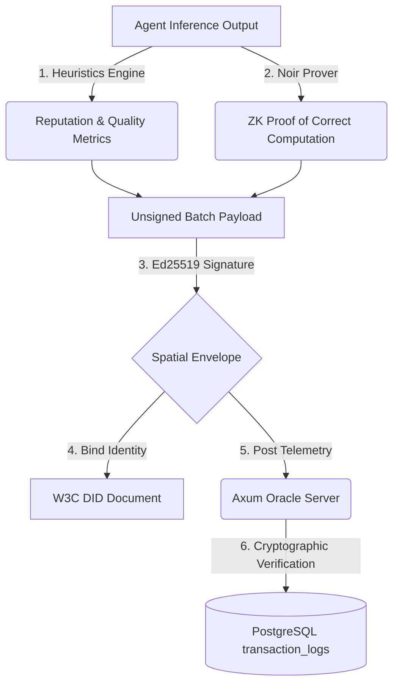

# Integrity Protocol Python SDK

A premium, cryptographic telemetry SDK that secures the cognitive integrity and reputation of AI agents, trading systems, and Mixture-of-Experts (MoE) topologies. The SDK is designed to run asynchronously, capturing deep execution metadata, pricing details, token-level certainty metrics, and system/GPU states, before producing a zero-knowledge verifiable transaction batch.

---

## Features

* **Asynchronous telemetry pipeline:** Completely non-blocking background queueing ensures zero latency overhead on main agent execution.
* **SQLite Offline Cache Fallback:** Seamlessly caches signed telemetry locally inside SQLite (`~/.integrity/offline_moat.db`) when connection is down and auto-syncs when online, guaranteeing zero data loss.
* **DID Identity Binding:** Automatically registers and binds agent identity to W3C Decentralised Identifiers (DIDs) and local hardware keys.
* **Automatic Cognitive Metrics:** Computes perplexity, Type-Token Ratio (TTR) vocabulary diversity, structural compliance, mean confidence, and min probability dynamically.
* **Inference Pipeline Extractor:** Ingests raw outputs from standard providers (OpenAI, Anthropic, HuggingFace, Together.ai) and automatically normalizes tokens, costs, and latencies.
* **Hardware & GPU Attestation:** Captures real-time CPU, RAM, and active NVIDIA GPU coprocessor performance profiles (vram, temperature, utilization) using system FFI.
* **Zero-Knowledge Ready:** Batches telemetry and constructs cryptographic commitments ready for verification.

---

## Cryptographic Trust Architecture: W3C DIDs & Noir ZK-Proofs

The Integrity Protocol secures agent telemetry and reputation scores using a two-tier cryptographic model:



### 1. W3C Decentralised Identifiers (DIDs) & Non-Repudiation
The SDK derives a deterministic hardware fingerprint from the agent's active execution host (machine ID, hostname, and MAC address) and registers a W3C-compliant DID (e.g. `did:xibalba:<hash>`). Telemetry batches are signed using the agent's private key, and the Axum Oracle validates these signatures against the public key inside the registered DID document, preventing rogue CLI injection or telemetry spoofing.

### 2. Aztec Noir Zero-Knowledge (ZK) Proofs
Autonomous agents often process highly sensitive business plans, trade instructions, or PII. Directly publishing raw text completions or fine-grained token logprobs violates privacy. The SDK runs Aztec Noir ZK circuits locally, taking sensitive logprobs and outputs as *private inputs* and calculating cognitive quality metrics. The resulting ZK-proof is posted publicly, allowing auditors to mathematically verify that quality scores were honestly calculated *without* ever revealing the sensitive agent inputs or completions!

### 3. Cryptographic Division of Labor (Who Does What?)
To maximize performance, security, and privacy, the labor of generating, validating, and anchoring these telemetry dimensions is strictly divided across three tiers:

| Attribute | Tier 1: Agent & SDK (Local Host) | Tier 2: Axum Oracle (Off-Chain Server) | Tier 3: Solidity Smart Contracts (Base L2) |
| :--- | :--- | :--- | :--- |
| **Primary Role** | **Generation & Proving** | **Cryptographic Verification** | **Registry & Economic State** |
| **ZK-Proof Action** | Runs the Noir prover locally to compile secret inputs (text, logprobs) into ZK proofs. | Mathematically verifies ZK proofs using Aztec FFI backend (never trusts raw numbers). | Roots Merkle anchors off-chain state. Verifies state transitions if challenged. |
| **DID & Identity** | Signs the spatial envelope batch payload using the node's local private key. | Resolves the agent's W3C DID, extracts public key, and verifies the Ed25519 signature. | Stores DID identity bindings, mapping staking addresses to registered hardware fingerprints. |
| **Trust Stance** | Operates on local private inputs; trusted to sign its own hardware commits. | **Zero-Trust:** Verifies all signatures and mathematical proofs before DB ingestion. | Enforces $ITK staking boundaries, slashing bad-faith models if audits fail. |

---

## Installation

Install directly using standard python packaging tools:

```bash
pip install -e .
```

---

## Quick Start

### 1. Simple Telemetry Log

For simple execution flows, log arbitrary key-value metadata alongside manual quality ratings:

```python
from integrity_sdk import IntegrityClient

# Initialise client - binds identity cryptographically
client = IntegrityClient(
    agent_id="xibalba",
    oracle_url="http://localhost:3001/ingest"
)

# Log a simple transaction step
client.log_telemetry(
    entropy=0.15,
    grounding=0.92,
    metadata={
        "task_name": "arbitrage_scan",
        "action": "buy_limit",
        "ticker": "BTC-USD"
    }
)

# Ensure all background batches flush cleanly before stopping
client.shutdown()
```

---

## 2. Ingesting Raw Inference Responses

The `log_inference` gateway hooks directly into your LLM pipelines to extract premium cognitive data.

### OpenAI / compatible pipelines (e.g. Together, Fireworks, Groq)
Pass raw completions straight from the API:

```python
response = openai.chat.completions.create(
    model="gpt-4o",
    messages=[{"role": "user", "content": "Execute compliance checks."}],
    logprobs=True
)

client.log_inference(
    provider="openai",
    raw_data=response.model_dump(),  # raw response dictionary
    latency_ms=320.5,
    ttft_ms=50.2,
    subagent_id="IntegrityAuditor"
)
```

### Anthropic Claude Responses
Simply pass Claude messages:

```python
message = anthropic.messages.create(
    model="claude-3-5-sonnet-20241022",
    max_tokens=1000,
    messages=[{"role": "user", "content": "Audit portfolio drawdowns."}]
)

client.log_inference(
    provider="anthropic",
    raw_data=message.to_dict(),
    latency_ms=640.2,
    subagent_id="XibalbaTrader"
)
```

---

## 3. Under the Hood: Extracted & Calculated Data

Every inference payload ingested is automatically parsed to populate:

### A. Dynamic Reputation & Cognitive Heuristics
* **Vocabulary Diversity (Type-Token Ratio):** Measures linguistic richness and catches infinite repetition loops.
* **Mean Token Confidence ($e^{\text{avg}(\text{logprobs})} \times 100\%$):** Tracks LLM certainty.
* **Min Token Probability ($e^{\min(\text{logprobs})} \times 100\%$):** Catches high-risk, low-probability token transitions.
* **Perplexity ($e^{-\text{avg}(\text{logprobs})}$):** Gauges predictability and coherence.
* **Structural Compliance:** Flags schema violations or parsing errors.

### B. Hardware, Network, and VCS Git Profiling
Every log automatically records the local execution profile:
* **Host Metrics:** Active CPU percent, memory usage ratio, and process IDs.
* **NVIDIA GPU State:** Deep FFI checks for active GPU Model Name, VRAM usage, Core Utilization, and Temperature ($^\circ$C).
* **Network & Node Attestation:** Captures host MAC address, system hostname, and active network local IP interface to confirm spatial provenance.
* **Code Version Control Bindings:** Automatically extracts Git commit hash, current active branch, remote repository URL, and working tree dirty flags (uncommitted changes) to guarantee code origin.
* **Runtime & User Verification:** Logs the active OS platform release, Python runtime version, and active system username running the process.

### C. Financial Auditing
* **Automatic Cost Calculation:** Maps input and output token volumes to current standard USD price metrics.
* **Throughput Heuristic:** Tracks exact tokens generated per second based on call latency.

---

## 4. Multi-Agent & Orchestrator Integration

To secure a group of subagents (e.g., an MoE group), initialize individual client instances for subagents with the primary parent `agent_id` and the subagent name as `subagent_id`:

```python
# Initialize subagent compliance monitor
compliance_client = IntegrityClient(
    agent_id="xibalba",          # Parent Identity
    subagent_id="IntegrityAuditor" # Subagent Identity
)

# Telemetry is automatically tied to both
compliance_client.log_telemetry(
    metadata={
        "over_sized_count": 0,
        "warnings": 0
    }
)
compliance_client.shutdown()
```

---

## Tokenomics & The Game-Theoretic Trust Loop ($ITK)

The off-chain telemetry collected and signed by this SDK directly feeds the protocol's game-theoretic trust and economic model managed by on-chain Solidity contracts on Base L2:

1. **Reputation Collateral (Staking):** Before an agent is authorized, its operator must stake a required floor of `$ITK` tokens in `IntegrityRegistry.sol`. This ensures financial collateral is tied to the agent's identity.
2. **Programmatic Slashing:** Decentralized compliance verifiers monitor the off-chain Postgres database logs. If an agent commits a protocol violation (e.g. oversized trades, massive drawdowns, or severe cognitive hallucinations), a **Proof of Violation** is submitted on-chain, programmatically slashing a portion of the agent's staked `$ITK` token bond.
3. **Reputation Lift:** Maintaining compliant execution over time raises the agent's **Agent Integrity Score (AIS)**, which programmatically lowers the operator's required `$ITK` collateral floor.

---

## Verification & Architecture

All logged batches are signed with the agent's private key registered inside its W3C-compliant DID document (`/home/xibalba/.hermes/did/document.json`), ensuring zero-spoofing integrity from external CLI or rogue execution processes. The Axum Oracle (`http://localhost:3001`) verifies this signature using the agent's registered public key before persistence into PostgreSQL.
