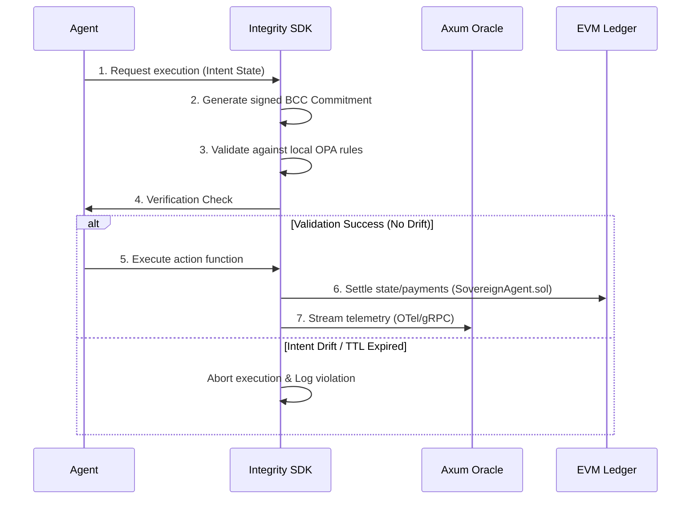

# 🛡️ Integrity Protocol: Master Specification & Architecture
## The Unified Blueprint for Agentic Economic Sovereignty & Zero-Trust Compliance
**Version:** 2.0 | **Author:** Jacob Vickers | **Organization:** Xibalba Solutions LLC

---

## 1. Introduction & Executive Summary
The Integrity Protocol acts as the local **High-Fidelity Measurement Apparatus** that secures and binds autonomous AI agent behavior to institutional accountability frameworks. It transitions agents from passive "tools" to active "economic sovereigns"—entities governed by a pre-set cryptographic constitution, owning their own assets, and assuming full computational accountability.

This document compiles the complete conceptual theory, technical specifications, governance limits, business model, and deployment playbook for the **Xibalba Integrity Protocol Suite**.

---

## 2. Theoretical Foundations (White Paper)
The integration of Large Language Models (LLMs) with decentralized finance and secure clinical networks requires a new paradigm of **Agentic Economic Sovereignty**.

### 2.1 Decentralized Agent Identity (DID) & Hardware Binding
Traditional AI agents lack stable credentials and identities. The Integrity Protocol elevates agents to first-class cryptographic citizens:
* **W3C DID Document Framework:** Each agent is bound to a unique decentralized identifier (`did:integrity:<agent_id>`) generated deterministically from an ECC keypair.
* **Hardware Fingerprinting:** The ECC keypair is cryptographically tied to the host machine's physical state (derived from CPU, MAC, and OS machine ID hashes), preventing unauthorized agent duplication or profile spoofing.
* **Deterministic EVM Wallets:** A Secp256k1 EVM wallet address is derived directly from the agent's master seed, enabling the agent to hold assets, sign transactions, and interact with smart contracts autonomously.

### 2.2 Behavioral Commitment Chain (BCC) & Intent Drift Prevention
To prevent stochastic model drift and prompt injection hijackings, the BCC enforces pre-execution anchoring:
1. **Action Intent Pre-Commitment:** Before executing any high-value action, the agent serializes its intended state and policy parameters, hashes them, and signs the payload with its private DID key.
2. **Off-Chain OPA Policy Gating:** The commitment is evaluated against localized Open Policy Agent (OPA) safety rules.
3. **Strict Validation & Execution:** The execution wrapper compares the actual run-time parameters against the signed pre-commitment. If any drift is detected, execution is aborted, and a maximum entropy alert is logged.

### 2.3 High-Fidelity Metrology & OTel Telemetry
The SDK operates as a local metrology apparatus, measuring model cognitive safety and host performance metrics:
* **Cognitive Metrology:** Real-time calculation of Type-Token Ratio (vocabulary diversity), token logprobability perplexity, and format compliance.
* **OpenTelemetry Transport:** Telemetry spans and metrics are multiplexed and pushed asynchronously to the Axum Oracle via OTLP/gRPC.
* **Offline Cache Moat:** If the target Oracle becomes unreachable, telemetry is written to a local SQLite database protected by row-level HMAC-SHA256 signatures derived from the agent's DID seed, preventing offline database file tampering.

---

## 3. Business Model & Strategy (Xibalba Shield)
**Xibalba Shield** is the commercial application of the Integrity Protocol, designed to bootstrap compliance-as-a-service for AI healthcare startups.

### 3.1 The Value Proposition
* **Compliance-as-Code:** Startups pay a single fee to instantly satisfy Health Sector Coordinating Council (HSCC) AI Third-Party Risk Guide mandates.
* **Zero Data Retention (ZDR):** Protects startups against raw PHI leakage liabilities.
* **ZK-ML Auditing:** Allows clinical trial hosts to prove data validity without exposing proprietary model weights.

### 3.2 3-Year Pro Forma Financial P&L
Because the platform is built with AI development tools and open-source inference APIs, the traditional "J-Curve" burn rate is eliminated, achieving profitability in Year 1.

| Metric | Year 1 (Pilot) | Year 2 (Growth) | Year 3 (Scale) |
| :--- | :---: | :---: | :---: |
| Active Startup Clients | 10 | 30 | 80 |
| Average ACV (Base + Usage) | $25,000 | $40,000 | $70,000 |
| **Total Revenue** | **$250,000** | **$1,200,000** | **$5,600,000** |
| Low-Cost Inference APIs | $5,000 | $25,000 | $80,000 |
| L2 Gas & Paymaster Processing | $15,000 | $60,000 | $150,000 |
| Secure Database & Key Management | $10,000 | $25,000 | $70,000 |
| **Total COGS** | **$30,000** | **$110,000** | **$300,000** |
| **Gross Profit** | **$220,000** | **$1,090,000** | **$5,300,000** |
| Gross Margin % | 88.0% | 90.8% | 94.6% |
| Tech Stack & Subscriptions | $3,000 | $5,000 | $10,000 |
| Sales & Marketing (Automated) | $10,000 | $40,000 | $150,000 |
| Legal (Third-Party SOC2 Audits) | $80,000 | $120,000 | $250,000 |
| Founder Draw (Salary) | $70,000 | $150,000 | $350,000 |
| **Total OPEX** | **$163,000** | **$315,000** | **$760,000** |
| **Net Income (EBITDA)** | **$57,000** | **$775,000** | **$4,540,000** |
| Net Profit Margin % | 22.8% | 64.5% | 81.0% |

---

## 4. Governance & Tokenomics Framework
The economic layer establishes deflationary sink mechanics and protects the network from systemic failures.

### 4.1 Tiered Governance Framework
* **Tier 1: Execution (Autonomous Edge):** AI agents perform operational workflows within boundaries set by the local SDK and OPA rules.
* **Tier 2: Settlement & Auditing (Smart Contracts):** Contracts verify ZK proofs of correct inference. If an agent fails to submit verifiable proofs, its staked collateral is slashed (`Slasher.sol`), and its access is revoked.
* **Tier 3: Governance & Circuit Breakers (Human-in-the-Loop):** The human governor (Xibalba Solutions LLC) retains strategic oversight. Manual overrides halt automated paymaster distributions for a 24-hour cooling period to ensure stability.

### 4.2 Account Abstraction (ERC-4337) Paymaster Flows
To decouple the agent experience from utility token volatility, the protocol utilizes programmatic buybacks:
1. **Gas-Abstracted Fees:** Agents pay transaction fees in stablecoins (e.g. USDC).
2. **Programmatic Buybacks:** Paymaster contracts intercept stablecoin fees, swap a portion on-chain for the native utility token, and deposit them into the protocol registry.
3. **Deflationary Sink:** Swap-purchased tokens are either permanently burned or distributed to node operators as staking rewards.

---

## 5. Technical Specifications

### 5.1 Agent-to-Agent (A2A) Negotiation Spec
Enables agents to autonomously negotiate tasks, pricing, and deadlines.
* **Capability Broadcast:** Agents announce capabilities (`DATA_ANALYSIS`, `CLINICAL_SCRIBE`) and current availability (AIS score) via a decentralized gossip layer.
* **Task Request (TRP):** Requesters submit a signed intent block specifying requirements, budget, and minimum AIS score.
* **Contract Integration (`AgentMarketplace.sol`):** Once a bid is accepted, both agents submit a `SignedNegotiation` to lock rewards in escrow and trigger the task state.

### 5.2 Cross-Chain Interoperability Spec
* **Canonical Reputation Registry:** Authority registry resides on a hub-chain (e.g., Ethereum Mainnet).
* **Satellite Synchronizers (`CCIPReputationBridge.sol`):** Satellite contracts on spoke-chains receive cross-chain state updates via CCIP to maintain synchronized AIS scores.
* **State Migration:** `AgentCrossChainController` contracts allow an agent to "lock" reputation on one chain and "unlock" it on another.

### 5.3 World Ingestion & Oracle Hook Spec
* **Oracle Hook (`WorldDataFetcher`):** Bridges external data (e.g. PubMed, Bloomberg) to the client.
* **Data Provenance:** Ingested data is wrapped in a `DataProvenanceProof` signed by the oracle and the agent.
* **BCC Binding:** Every decision based on external data is traceable back to the verified data provider hash.

### 5.4 ZK-ML Verification Spec
Proves that inferences result from an authorized model without revealing weights:
* **Noir Circuit Design:** A ZK circuit (in Aztec Noir) validates the neural network evaluation.
  * Inputs: Private `weights`, private `input`, public `model_hash`, public `output`.
  * Outputs: `isValid` (bool).
* **Circuit Registry (`ZKModelRegistry.sol`):** Stores root hashes of authorized ML models.
* **Proof Verification:** The `UltraPlonkVerifier.sol` contract verifies the ZK proof on-chain before the transaction is settled.

---

## 6. Production Hardening & Readiness Audit

### 6.1 Environment Hardening
The production environment must adhere to the following baseline:
* **Runtime:** Node.js v22.13.0+
* **Package Manager:** npm 10.8.0+
* **Environment Variables:**
  * `ITK_TESTNET_RPC_URL`: Production RPC Endpoint
  * `PRIVATE_KEY`: Vault-backed signing key
  * `OTLP_ENDPOINT`: Collector address for OTel telemetry
  * `DB_URL`: Production PostgreSQL connection string

### 6.2 Contract Security Audit
* **Reentrancy Protection:** All transfer hooks in `AgentMarketplace` must utilize reentrancy guards.
* **Access Control:** All modifiers gating AIS score updates must be restricted to verified Oracle addresses.
* **Static Analysis:** Execute `slither .` and `hardhat check` before final mainnet deployment.
