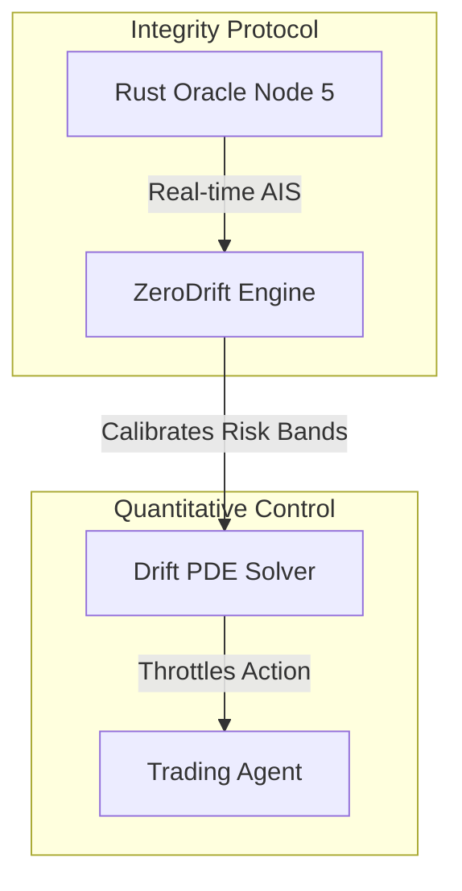

# Quant ZeroDrift

**Quantitative Financial Control Engine for the Integrity Protocol.**

## Overview

`quant_zerodrift` is a high-performance C++ solver designed to prevent algorithmic runaway and "drift" in autonomous trading agents. While Xibalba Shield provides cryptographic HIPAA compliance for healthcare, ZeroDrift serves as the reference implementation for the **Quantitative Finance Domain (Domain ID: `QUANT_01`)**.

It leverages the Integrity Protocol's Agent Integrity Score (AIS) to dynamically throttle trading algorithms, bridging non-deterministic AI behavior with rigorous control theory.

## Table of Contents
- [Architecture & Protocol Role](#architecture--protocol-role)
- [AIS-Based Control Theory](#ais-based-control-theory)
- [Installation & Compilation](#installation--compilation)
- [Usage](#usage)

## Architecture & Protocol Role

ZeroDrift operates as an execution governor, translating the generic Trust Level from the Rust Oracle into actionable mathematical bounds:



### Key Responsibilities
1. **Dynamic Risk Calibration:** High AIS agents are granted wider volatility bands. Low AIS agents (those exhibiting high entropy or drift) are immediately restricted.
2. **State Vector Alignment:** Synchronizes the agent's behavioral state vectors with market ticks to detect hidden divergence before financial loss occurs.

## AIS-Based Control Theory

The engine solves a modified Black-Scholes-Merton partial differential equation, featuring an added drift penalty term linked inversely to the agent's performance variance (the $S_{entropy}$ metric from the Tri-Metric Scoring Engine). 

If an agent begins to hallucinate or deviate from its core mandate, its AIS drops, which tightens the stochastic boundary condition in the PDE solver, mechanically preventing outsized trades.

## Installation & Compilation

### Prerequisites
- GCC/G++ (v9.0+)
- Make

### Build the Engine
```bash
cd quant_zerodrift
g++ -O3 main.cpp -o zerodrift
```

## Usage

Run the controller by specifying a risk limit and a target minimum AIS from the Oracle:

```bash
./zerodrift --risk-limit 0.05 --min-ais 850
```

If the agent's AIS drops below 850, the risk limits mechanically tighten to zero until human intervention (HIL) resets the grounding metric ($S_{grounding}$).
