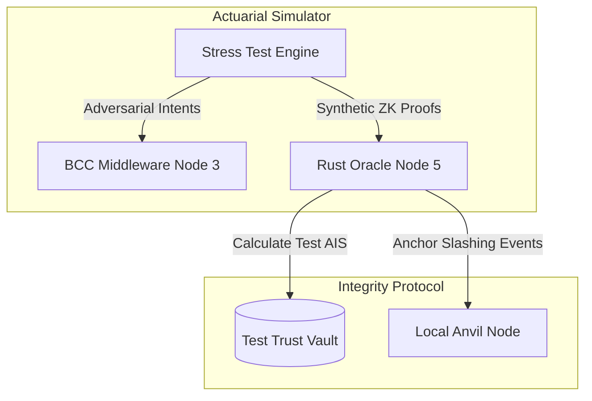

# Actuarial Simulations

**Stress Testing and Actuarial Analysis for the Xibalba Integrity Protocol.**

## Overview

The `simulation` directory contains the core actuarial scripts used to model and stress-test the Integrity Protocol. It simulates high-frequency autonomous agent networks, testing how the Rust Oracle (Node 5) and Base L2 Contracts (Node 1) handle varying Trust Levels (AIS), network loads, and SLA slashing events.

These simulations are critical for tuning the weights of the **Tri-Metric Scoring Engine** ($w_E$, $w_G$, $w_S$, $w_C$) and proving that the mathematical FICO score for AI remains stable under adversarial conditions (e.g., mass prompt-injection attacks or model drift).

## Table of Contents
- [Architecture & Protocol Role](#architecture--protocol-role)
- [Simulation Types](#simulation-types)
- [Installation & Setup](#installation--setup)
- [Usage](#usage)

## Architecture & Protocol Role

The simulator acts as a mock swarm of Node 4 Agents, generating synthetic intents and telemetry to test the backend nodes:



### Key Responsibilities
1. **Load Testing:** Bombarding the Rust Oracle with thousands of telemetry events per second to ensure the Axum server and Alloy 2.0 WebSockets maintain throughput.
2. **Economic Modeling:** Simulating the financial impact of agent hallucinations on $ITK staking pools.
3. **Validation Ladder Testing:** Ensuring agents cannot artificially inflate their AIS beyond the Tier 1 threshold (300/600) without providing simulated hardware attestations.

## Simulation Types

1. **`stress_test_simulation.py`**: A general load tester for the Oracle's ingestion pipeline.
2. **`actuarial_drift.py`**: Simulates an LLM "drifting" over time (increasing entropy) and verifies that the Oracle correctly penalizes its AIS, triggering a `SmartBAA.sol` slash.

## Installation & Setup

### Prerequisites
- Python 3.10+
- A running local instance of the `integrity-oracle`
- A running local instance of `anvil` (Foundry local node)

### Setup
```bash
cd simulation
pip install -r requirements.txt
```

## Usage

Ensure your local Oracle is running on `http://localhost:3000`.

Run the primary stress test:
```bash
python stress_test_simulation.py --agents 500 --events 10000
```

Run the actuarial drift scenario:
```bash
python actuarial_drift.py --target-entropy 0.8
```
